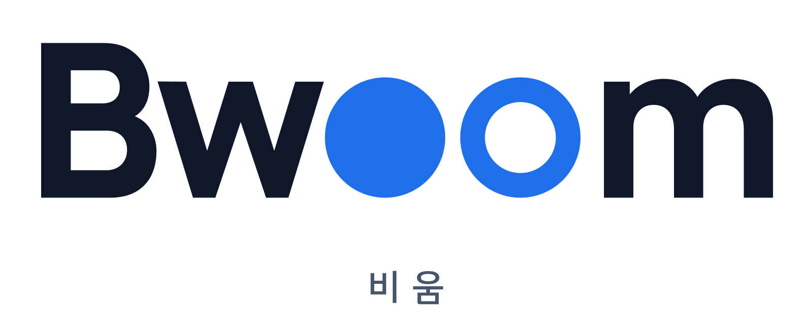
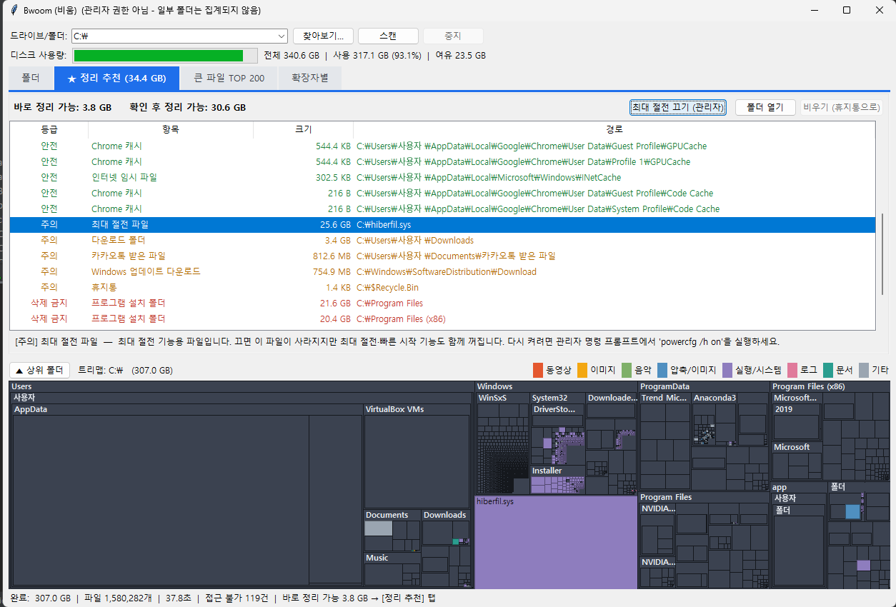

<p align="center"></p>

# Bwoom (비움)

**C드라이브가 꽉 찼을 때, 뭘 지워야 하는지까지 알려주는 무료 용량 분석기**

> 비움 + Broom(빗자루) + Boom(펑!) — 쌓인 용량을 쓸어서 한 번에 비워요.



기존 용량 분석 프로그램은 "어디가 큰지"만 보여줍니다. 그런데 막상 큰 폴더를 찾아도 **이거 지워도 되나?** 싶어서 손을 못 대는 경우가 대부분이죠.
Bwoom은 용량을 차지하는 폴더를 **안전 / 주의 / 삭제 금지** 세 단계로 나눠서, 지워도 되는 것만 골라 휴지통으로 비울 수 있게 도와줍니다.

## 주요 기능

- **정리 추천** — 스캔이 끝나면 "바로 정리 가능 3.2 GB" 처럼 확보할 수 있는 공간을 바로 알려줍니다.
  - 🟢 **안전**: 임시 파일, 브라우저 캐시(Chrome·Edge·네이버 웨일), 오류 덤프, npm/pip 캐시 → 버튼 한 번으로 비우기
  - 🟠 **주의**: 다운로드 폴더, 카카오톡 받은 파일, 휴지통, Windows 업데이트 파일 → 직접 확인하도록 안내
  - 🔴 **삭제 금지**: WinSxS, Installer, System32, Program Files 등 → 실수로 지우려 해도 막아줌
  - 명령어를 몰라도 되는 **정리 버튼**: 최대 절전 끄기, WinSxS 구성 요소 정리(DISM), 디스크 정리, 휴지통 비우기
- **PM2 관리** — 개발자 PC에서 몰래 수십 GB씩 쌓이는 PM2 로그를 찾아내고, 앱 상태(재시작 반복 여부)와 에러 내용을 보고, 버튼으로 로그 비우기·앱 중지·로그 자동 정리(pm2-logrotate) 설치까지
- **폴더 트리** — 폴더·파일을 크기순으로 정렬, 상위 폴더 대비 비율과 파일 수 표시
- **트리맵** — 디스크를 한눈에 보는 지도. 파일 종류별 색상, 클릭하면 위치 찾기, 더블클릭하면 폴더 안으로
- **큰 파일 TOP 200** — 잊고 있던 대용량 파일 찾기
- **확장자별 통계** — 동영상·이미지·압축 파일이 각각 얼마나 차지하는지
- **안전한 삭제** — 직접 고른 파일·폴더 삭제는 휴지통으로. "안전" 등급 캐시·임시 파일 비우기는 휴지통을 거치지 않고 바로 삭제(공간이 즉시 늘어남). 사용 중인 파일은 자동으로 건너뜀

## 다운로드

[Releases](../../releases) 페이지에서 `Bwoom.exe`를 받아 실행하세요. 설치가 필요 없습니다.

> **"Windows의 PC 보호" 경고가 뜨나요?**
> 서명 인증서가 없는 새 프로그램이라 뜨는 경고입니다. `추가 정보` → `실행`을 누르면 됩니다.
> 불안하다면 이 저장소의 소스 코드를 직접 확인하거나, 아래 방법으로 직접 빌드할 수 있습니다.
> 각 릴리스에는 VirusTotal 검사 결과 링크를 함께 올립니다.

**관리자 권한으로 실행**하면 시스템 폴더까지 빠짐없이 집계됩니다. (일반 권한으로도 동작하지만 일부 폴더가 "접근 불가"로 빠집니다)

## 직접 실행 / 빌드

Python 3.9 이상이 필요합니다.

```bash
pip install send2trash        # 휴지통 삭제 기능 (선택)
python bwoom.py
```

exe로 만들기:

```bash
pip install pyinstaller
pyinstaller --onefile --windowed --name Bwoom --icon bwoom.ico --add-data "bwoom.ico;." --add-data "bwoom.png;." bwoom.py
```

`dist/Bwoom.exe`가 생성됩니다. macOS·Linux에서도 실행되며, 정리 추천 규칙은 운영체제에 맞게 바뀝니다.

## 자주 묻는 질문

**WizTree랑 뭐가 다른가요?**
WizTree는 NTFS 파일 목록(MFT)을 직접 읽어서 스캔 속도가 훨씬 빠릅니다. 대신 크기만 보여주고, 회사에서 쓰려면 유료 라이선스가 필요합니다.
Bwoom은 속도는 조금 느리지만(파일 수백만 개 기준 1~3분) **뭘 지워도 되는지 알려주는 것**에 집중했고, 개인·회사 모두 무료인 오픈소스입니다.

**WinSxS 폴더가 너무 큰데 지우면 안 되나요?**
직접 지우면 Windows가 손상됩니다. 또 하드링크 때문에 실제보다 크게 보입니다. 관리자 명령 프롬프트에서 아래 명령으로만 정리하세요.
```
Dism /Online /Cleanup-Image /StartComponentCleanup
```

**정리 추천 결과가 하나도 안 나와요.**
특정 폴더만 스캔하면 추천 대상이 범위 밖일 수 있습니다. `C:\` 전체를 스캔해 보세요.

**합계가 Windows에 표시되는 사용량과 달라요.**
권한이 없는 폴더, 시스템 복원 지점, 하드링크 중복 집계 등의 차이입니다. 관리자 권한으로 실행하면 차이가 줄어듭니다.

## 기여하기

정리 추천 규칙(`cleanup_rules()`)에 추가하고 싶은 폴더가 있다면 이슈나 PR로 알려주세요.
특히 한국에서 많이 쓰는 프로그램(메신저, 게임 런처, 은행 보안 프로그램 등)의 캐시 경로 제보를 환영합니다.
"안전" 등급은 **지워도 프로그램이 다시 만들어내는 파일**만 넣는 것이 원칙입니다.

## 라이선스

MIT License
